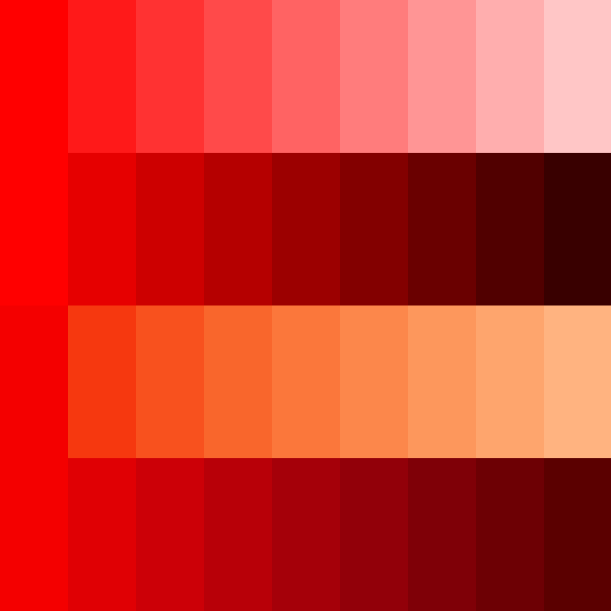

## Color

### Color <a id="color"></a>

Utility class for manipulating colors.

- [new Color(color)](#color-constructor)
  - .isColor: `true`
  - [.r](#color-r): `number`
  - [.g](#color-g): `number`
  - [.b](#color-b): `number`
  - [.rgb](#color-rgb): `[number, number, number]`
  - [.hex](#color-hex): `number`
  - [.hexString](#color-hex-string): `readonly string`
  - [.hsl](#color-hsl): `[number, number, number]`
  - [.hslString](#color-hsl-string): `readonly string`
  - [.hsb](#color-hsb): `[number, number, number]`
  - [.lab](#color-lab): `[number, number, number]`
  - [.hcl](#color-hcl): `[number, number, number]`
  - [.set(color)](#color-set-method): `this`
  - [.setColorName(colorName)](#color-set-color-name-method): `this`
  - [.setRgb(rgb)](#color-set-rgb-method): `this`
  - [.setHex(hex)](#color-set-hex-method): `this`
  - [.setHsl(hsl)](#color-set-hsl-method): `this`
  - [.setHsb(hsb)](#color-set-hsb-method): `this`
  - [.setLab(lab)](#color-set-lab-method): `this`
  - [.setHcl(hcl)](#color-set-hcl-method): `this`
  - [.lerp(t, color)](#color-lerp-method): `this`
  - [.lerpRgb(t, rgb, params?)](#color-lerp-rgb-method): `this`
  - [.lerpHsl(t, hsl, params?)](#color-lerp-hsl-method): `this`
  - [.lerpHsb(t, hsb, params?)](#color-lerp-hsb-method): `this`
  - [.interpolateQualitative(t, hcl, params?)](#color-interpolate-qualitative-method): `this`
  - [.interpolateSequential(t, hcl, params?)](#color-interpolate-sequential-method): `this`
  - [.interpolateDiverging(t, hcl, params?)](#color-interpolate-diverging-method): `this`
  - [.equals(color)](#color-equals-method): `boolean`
  - [.toArray()](#color-to-array-method): `[number, number, number]`
  - [.fromArray(values)](#color-from-array-method): `this`
  - [.copy(color)](#color-copy-method): `this`
  - [.clone()](#color-clone-method): `Color`
  - `static` [.lerpRgb(t, rgb1, rgb2, params?)](#color-lerp-rgb-static-method): `[number, number, number]`
  - `static` [.lerpHsl(t, hsl1, hsl2, params?)](#color-lerp-hsl-static-method): `[number, number, number]`
  - `static` [.lerpHsb(t, hsb1, hsb2, params?)](#color-lerp-hsb-static-method): `[number, number, number]`
  - `static` [.interpolateQualitative(t, hcl1, hcl2, params?)](#color-interpolate-qualitative-static-method): `[number, number, number]`
  - `static` [.interpolateSequential(t, hcl1, hcl2, params?)](#color-interpolate-sequential-static-method): `[number, number, number]`
  - `static` [.interpolateDiverging(t, hcl1, hcl2, params?)](#color-interpolate-diverging-static-method): `[number, number, number]`
  - `static` [.lerpHue(t, h1, h2, mode?)](#color-lerp-hue-static-method): `number`
  - `static` [.equals(color1, color2)](#color-equals-static-method): `boolean`

#### Types

Color interpolation parameters: <a id="color-interpolation-parameters"></a>

```ts
/**
 * Parameters used for color interpolation
 */
type ColorInterpolationsParameters = {
  rgb: Parameters<typeof Color.lerpRgb>[3];
  // { power?: number }
  hsl: Parameters<typeof Color.lerpHsl>[3];
  // { power?: number | [number, number, number]; hueMode?: HueInterpolationMode }
  hsb: Parameters<typeof Color.lerpHsb>[3];
  // { power?: number | [number, number, number]; hueMode?: HueInterpolationMode }
  qualitative: Parameters<typeof Color.interpolateQualitative>[3];
  // { hueMode?: HueInterpolationMode }
  sequential: Parameters<typeof Color.interpolateSequential>[3];
  // { power?: number | [number, number]; hueMode?: HueInterpolationMode; chromaMax?: number }
  diverging: Parameters<typeof Color.interpolateDiverging>[3];
  // { power?: number | [number, number] }
};

/**
 * Type of interpolation
 */
type ColorInterpolation = keyof ColorInterpolationsParameters; // 'rgb' | 'hsl' | 'hsb' | 'qualitative' | 'sequential' | 'diverging';

/**
 * Type of hue interpolation
 */
type HueInterpolationMode = 'direct' | 'shortest' | 'longest';
```

#### Constructor <a id="color-constructor"></a>

| Parameter | Type                  | Default    | Description                        |
| --------- | --------------------- | ---------- | ---------------------------------- |
| color     | `ColorRepresentation` | `0x000000` | Color representation of the color. |

#### Properties

##### .`r` <a id="color-r"></a>

Red value of the color in the RGB color space.

```ts
Color.r: number;
```

##### .`g` <a id="color-g"></a>

Green value of the color in the RGB color space.

```ts
Color.g: number;
```

##### .`b` <a id="color-b"></a>

Blue value of the color in the RGB color space.

```ts
Color.b: number;
```

##### .`rgb` <a id="color-rgb"></a>

RGB values of the color.

```ts
Color.rgb: [number, number, number];
```

##### .`hex` <a id="color-hex"></a>

Hexadecimal value of the color.

```ts
Color.hex: number;
```

##### .`hexString` <a id="color-hex-string"></a>

Hexadecimal string representing this color

```ts
Color.hexString: readonly string;
```

##### .`hsl` <a id="color-hsl"></a>

HSL values of the color.

```ts
Color.hsl: [number, number, number];
```

##### .`hslString` <a id="color-hsl-string"></a>

HSL string representing the color (format: 'hsl(360, 100%, 100%)').

```ts
Color.hslString: readonly string;
```

##### .`hsb` <a id="color-hsb"></a>

HSB values of the color.

```ts
Color.hsb: [number, number, number];
```

##### .`lab` <a id="color-lab"></a>

L\*a\*b\* values of the color.

```ts
Color.lab: [number, number, number];
```

##### .`hcl` <a id="color-hcl"></a>

HCL values of the color.

```ts
Color.hcl: [number, number, number];
```

#### Methods

##### .`set(color)` <a id="color-set-method"></a>

Set the color RGB values.

- `color`: Color to set.

```ts
Color.set(color: Color | ColorRepresentation): this;
```

##### .`setColorName(colorName)` <a id="color-set-color-name-method"></a>

Set the color values from a given color name.

- `setColorName`: Color name of the color to set.

```ts
Color.setColorName(colorName: string): this;
```

##### .`setRgb(rgb)` <a id="color-set-rgb-method"></a>

Set the color values from a given RGB color.

- `rgb`: RGB color.

```ts
Color.setRgb(rgb: [number, number, number]): this;
```

##### .`setHex(hex)` <a id="color-set-hex-method"></a>

Set the color values from a given hexadecimal color.

- `hex`: Hexadecimal color.

```ts
Color.setHex(hex: string): this;
```

##### .`setHsl(hsl)` <a id="color-set-hsl-method"></a>

Set the color values from a given HSL color.

- `hsl`: HSL color.

```ts
Color.setHsl(hsl: [number, number, number]): this;
```

##### .`setHsb(hsb)` <a id="color-set-hsb-method"></a>

Set the color values from a given HSB color.

- `hsb`: HSB color.

```ts
Color.setHsb(hsb: [number, number, number]): this;
```

##### .`setLab(lab)` <a id="color-set-lab-method"></a>

Set the color values from a given L\*a\*b\* color.

- `lab`: L\*a\*b\* color.

```ts
Color.setLab(lab: [number, number, number]): this;
```

##### .`setHcl(hcl)` <a id="color-set-hcl-method"></a>

Set the color values from a given HCL color.

- `hcl`: HCL color.

```ts
Color.setHcl(hcl: [number, number, number]): this;
```

##### .`lerp(t, color)` <a id="color-lerp-method"></a>

Linearly interpolate the color values to given color values.

- `t`: Normalized time value to interpolate.
- `color`: Color to interpolate values towards.

```ts
Color.lerp(t: number, color: Color | [number, number, number]): this;
```

##### .`lerpRgb(t, rgb, params?)` <a id="color-lerp-rgb-method"></a>

Linearly interpolate the color RGB values towards given RGB values.

- `t`: Normalized time value to interpolate.
- `rgb`: RGB values to interpolate towards.
- `[params]`: Interpolation parameters.
  - `[params.power]`: Interpolation exponent.

```ts
Color.lerpRgb(
  t: number,
  rgb: [number, number, number],
  params?: { power?: number }
): this;
```

##### .`lerpHsl(t, hsl, params?)` <a id="color-lerp-hsl-method"></a>

Linearly interpolate the color HSL values towards given HSL values.

- `t`: Normalized time value to interpolate.
- `hsl`: HSL values to interpolate towards.
- `[params]`: Interpolation parameters.
  - `[params.power]`: Interpolation exponent(s) : [h, s, l].
  - `[params.hueMode]`: Hue interpolation mode. Can be 'direct' | 'shortest' | 'longest'.

```ts
Color.lerpHsl(
  t: number,
  hsl: [number, number, number],
  params?: { power?: number | number[]; hueMode?: 'direct' | 'shortest' | 'longest' }
): this;
```

##### .`lerpHsb(t, hsb, params?)` <a id="color-lerp-hsb-method"></a>

Linearly interpolate the color HSB values towards given HSB values.

- `t`: Normalized time value to interpolate.
- `hsb`: HSB values to interpolate towards.
- `[params]`: Interpolation parameters.
  - `[params.power]`: Interpolation exponent(s) : [h, s, b].
  - `[params.hueMode]`: Hue interpolation mode. Can be 'direct' | 'shortest' | 'longest'.

```ts
Color.lerpHsb(
  t: number,
  hsb: [number, number, number],
  params?: { power?: number | number[]; hueMode?: 'direct' | 'shortest' | 'longest' }
): this;
```

##### .`interpolateQualitative(t, hcl, params?)` <a id="color-interpolate-qualitative-method"></a>

Interpolate the color HCL values towards given HCL values following HCL Qualitative color palettes algorithm.

- `t`: Normalized time value to interpolate.
- `hcl`: HCL values to interpolate towards.
  - `[params]`: Interpolation parameters.
  - `[params.hueMode]`: Hue interpolation mode. Can be 'direct' | 'shortest' | 'longest'.

```ts
Color.interpolateQualitative(
  t: number,
  hcl: [number, number, number],
  params?: { hueMode?: 'direct' | 'shortest' | 'longest' }
): this;
```

##### .`interpolateSequential(t, hcl, params?)` <a id="color-interpolate-sequential-method"></a>

Interpolate the color HCL values towards given HCL values following HCL Sequential color palettes algorithm.

- `t`: Normalized time value to interpolate.
- `hcl`: HCL values to interpolate towards.
- `[params]`: Interpolation parameters.
  - `[params.power]`: Interpolation exponent(s) : [h, c, l].
  - `[params.hueMode]`: Hue interpolation mode. Can be 'direct' | 'shortest' | 'longest'.
  - `[params.chromaMax]`: Maximum chroma value.

```ts
Color.interpolateSequential(
  t: number,
  hcl: [number, number, number],
  params?: { power?: number | number[]; hueMode?: 'direct' | 'shortest' | 'longest'; chromaMax?: number }
  ): this;
```

##### .`interpolateDiverging(t, hcl, params?)` <a id="color-interpolate-diverging-method"></a>

Interpolate the color HCL values towards given HCL values following HCL Diverging color palettes algorithm.

- `t`: Normalized time value to interpolate.
- `hcl`: HCL values to interpolate towards.
- `[params]`: Interpolation parameters.
  - `[params.power]`: Interpolation exponent(s) : ([c, l]).

```ts
Color.interpolateDiverging(
  t: number,
  hcl: [number, number, number],
  params?: { power?: number | number[] }
): this;
```

##### .`equals(color)` <a id="color-equals-method"></a>

Check if the color is equal with a given color.

- `color`: Color to check.

```ts
Color.equals(color: Color | [number, number, number]): boolean;
```

##### .`toArray()` <a id="color-to-array-method"></a>

Return the color RGB values into an array.

```ts
Color.toArray(): [number, number, number];
```

##### .`fromArray(values)` <a id="color-from-array-method"></a>

Set the color RGB values from a given array.

- `values`: Values to set.

```ts
Color.fromArray(values: number[]): this;
```

##### .`copy(color)` <a id="color-copy-method"></a>

Copy the RGB values of a given color to the color.

- `color`: Color to copy values from.

```ts
Color.copy(color: Color | [number, number, number]): this;
```

##### .`clone()` <a id="color-clone-method"></a>

Create a new color with copied RGB values from the color.

```ts
Color.clone(): Color;
```

##### `static` Color.`lerpRgb(t, rgb1, rgb2, params?)` <a id="color-lerp-rgb-static-method"></a>

Linearly interpolate a color between two colors in the RGB color space.

- `t`: Normalized time value to interpolate.
- `rgb1`: Start color.
- `rgb2`: End color.
- `[params]`: Interpolation parameters.
  - `[params.power=1]` Interpolation exponent.

```ts
static Color.lerpRgb(
  t: number,
  rgb1: [number, number, number],
  rgb2: [number, number, number],
  params?: { power?: number }
): [number, number, number];
```

##### `static` Color.`lerpHsl(t, hsl1, hsl2
 params?)` <a id="color-lerp-hsl-static-method"></a>

Linearly interpolate a color between two colors in the HSL color space.

- `t`: Normalized time value to interpolate.
- `hsl1`: Start color.
- `hsl2`: End color.
- `[params]`: Interpolation parameters.
  - `[params.power=1]`: Interpolation exponent(s) : [h, s, l].
  - `[params.hueMode]`: Hue interpolation mode. Can be 'direct' | 'shortest' | 'longest'.

```ts
static Color.lerpHsl(
  t: number,
  hsl1: [number, number, number],
  hsl2: [number, number, number],
  params?: { power?: number | number[]; hueMode?: 'direct' | 'shortest' | 'longest' }
): [number, number, number];
```

##### `static` Color.`lerpHsb(t, hsb1, hsb2, params?)` <a id="color-lerp-hsb-static-method"></a>

Linearly interpolate a color between two colors in the HSB color space.

- `t`: Normalized time value to interpolate.
- `hsb1`: Start color.
- `hsb2`: End color.
- `[params]`: Interpolation parameters.
  - `[params.power=1]`: Interpolation exponent(s) : [h, s, b].
  - `[params.hueMode]`: Hue interpolation mode. Can be 'direct' | 'shortest' | 'longest'.

```ts
static Color.lerpHsb(
  t: number,
  hsb1: [number, number, number],
  hsb2: [number, number, number],
  params?: { power?: number | number[]; hueMode?: 'direct' | 'shortest' | 'longest' }
): [number, number, number];
```

##### `static` Color.`interpolateQualitative(t, hcl1, hcl2, params?)` <a id="color-interpolate-qualitative-static-method"></a>

Interpolate a color between 2 colors following HCL Qualitative color palettes algorithm.

- `t`: Normalized time value to interpolate.
- `hcl1`: Start color.
- `hcl2`: End color.
- `[params]`: Interpolation parameters.
  - `[params.hueMode]`: Hue interpolation mode. Can be 'direct' | 'shortest' | 'longest'.

```ts
static Color.interpolateQualitative(
  t: number,
  hcl1: [number, number, number],
  hcl2: [number, number, number],
  params?: { hueMode?: 'direct' | 'shortest' | 'longest' }
): [number, number, number];
```

##### `static` Color.`interpolateSequential(t, hcl1, hcl2, params?)` <a id="color-interpolate-sequential-static-method"></a>

Interpolate a color between 2 colors following HCL Sequential color palettes algorithm.

- `t`: Normalized time value to interpolate.
- `hcl1`: Start color.
- `hcl2`: End color.
- `[params]`: Interpolation parameters.
  - `[params.power=1]`: Interpolation exponent(s) : [c, l].
  - `[params.hueMode]`: Hue interpolation mode. Can be 'direct' | 'shortest' | 'longest'.
  - `[params.chromaMax]`: Maximum chroma value.

```ts
static Color.interpolateSequential(
  t: number,
  hcl1: [number, number, number],
  hcl2: [number, number, number],
  params?: { power?: number | number[]; hueMode?: 'direct' | 'shortest' | 'longest'; chromaMax?: number }
  ): [number, number, number];
```

##### `static` Color.`interpolateDiverging(t, hcl1, hcl2, params?)` <a id="color-interpolate-diverging-static-method"></a>

Interpolate a color between 2 colors following HCL Diverging color palettes algorithm.

- `t`: Normalized time value to interpolate.
- `hcl1`: Start color.
- `hcl2`: End color.
- `[params]`: Interpolation parameters.
  - `[params.power=1]`: Interpolation exponent(s) : [c, l].

```ts
static Color.interpolateDiverging(
  t: number,
  hcl1: [number, number, number],
  hcl2: [number, number, number],
  params?: { power?: number | number[] }
): [number, number, number];
```

##### `static` Color.`lerpHue(t, h1, h2, mode?)` <a id="color-lerp-hue-static-method"></a>

Interpolate a hue between two hue angles.

- `t`: Normalized time value to interpolate.
- `h1`: Start hue angle (in degrees).
- `h2`: End hue angle (in degrees).
- `[mode='direct']`: Hue interpolation mode. Can be 'direct' | 'shortest' | 'longest'.

```ts
static Color.lerpHue(
  t: number,
  h1: number,
  h2: number,
  mode?: 'direct' | 'shortest' | 'longest'
): number;
```

##### `static` Color.`equals(color1, color2)` <a id="color-equals-static-method"></a>

Check if two colors are equal to each other.

- `color1`: First color.
- `color2`: Second color.

```ts
static Color.equals(color1: Color | [number, number, number], color2: Color | [number, number, number]): boolean;
```

### ColorScale <a id="color-scale"></a>

Utility class for generating and processing color scales.

- new ColorScale()
  - .isColorScale: `true`
  - [.colors](#color-scale-colors): `Color[]`
  - [.length](#color-scale-length): `readonly number`
  - [.getColor(t)](#color-scale-get-color-method): `Color`
  - [.generate(interpolation, length, color1, color2, params?)](#color-scale-generate-method): `this`
  - [.generateRgb(length, color1, color2, params?)](#color-scale-generate-rgb-method): `this`
  - [.generateHsl(length, color1, color2, params?)](#color-scale-generate-hsl-method): `this`
  - [.generateHsb(length, color1, color2, params?)](#color-scale-generate-hsb-method): `this`
  - [.generateQualitative(length, color1, color2, params?)](#color-scale-generate-qualitative-method): `this`
  - [.generateSequential(length, color1, color2, params?)](#color-scale-generate-sequential-method): `this`
  - [.generateDiverging(length, color1, color2, params?)](#color-scale-generate-diverging-method): `this`
  - [.process(params?)](#color-scale-process-method): `this`
  - `static` [.generate(interpolation, length, color1, color2, params?)](#color-scale-generate-static-method): `Color[]`
  - `static` [.generateRgb(length, color1, color2, params?)](#color-scale-generate-rgb-static-method): `Color[]`
  - `static` [.generateHsl(length, color1, color2, params?)](#color-scale-generate-hsl-static-method): `Color[]`
  - `static` [.generateHsb(length, color1, color2, params?)](#color-scale-generate-hsb-static-method): `Color[]`
  - `static` [.generateQualitative(length, color1, color2, params?)](#color-scale-generate-qualitative-static-method): `Color[]`
  - `static` [.generateSequential(length, color1, color2, params?)](#color-scale-generate-sequential-static-method): `Color[]`
  - `static` [.generateDiverging(length, color1, color2, params?)](#color-scale-generate-diverging-static-method): `Color[]`
  - `static` [.processValue(value, target)](#color-scale-process-value-static-method): `number`
  - `static` [.processColor(color, params?)](#color-scale-process-color-static-method): `Color`
  - `static` [.process(scale, params?)](#color-scale-process-static-method): `ColorScale`

#### Types

ColorScale processing parameters: <a id="color-scale-processing-parameters"></a>

```ts
/**
 * Processing parameter used to modify an input value into a target.
 *   - If the target is a number, the input will be set to its value
 *   - If the target is an array of numbers, the input will be clamped inside the range [min, max]
 *   - If the target is undefined, the input will stay the same
 */
type ColorScaleProcessingTarget = number | [number, number] | undefined;

/**
 * Parameters used for color scale processing
 */
type ColorScaleProcessingParameters = {
  /**
   * Processing HSL modifiers
   */
  hsl?: {
    hue?: ColorScaleProcessingTarget;
    saturation?: ColorScaleProcessingTarget;
    lightness?: ColorScaleProcessingTarget;
  };
  /**
   * Processing HSB modifiers
   */
  hsb?: {
    hue?: ColorScaleProcessingTarget;
    saturation?: ColorScaleProcessingTarget;
    brightness?: ColorScaleProcessingTarget;
  };
  /**
   * Processing HCL modifiers
   */
  hcl?: {
    hue?: ColorScaleProcessingTarget;
    chroma?: ColorScaleProcessingTarget;
    luminance?: ColorScaleProcessingTarget;
  };
};
```

#### Properties

##### .`colors` <a id="color-scale-colors"></a>

Array of colors composing the color scale.

```ts
ColorScale.colors: Color[];
```

##### .`length` <a id="color-scale-length"></a>

Amount of colors composing the color scale.

```ts
ColorScale.length: readonly number;
```

#### Methods

##### .`getColor(t)` <a id="color-scale-get-color-method"></a>

Pick an interpolated color from the color scale.

- `t`: Normalized time value to interpolate.

```ts
ColorScale.getColor(t: number): Color;
```

##### .`generate(interpolation, length, color1, color2, params?)` <a id="color-scale-generate-method"></a>

Set the color scale colors to an array of interpolated colors.

- `interpolation`: Type of interpolation used for generation.
- `length`: Amount of colors to generate.
- `color1`: Start color.
- `color2`: End color.
- `[params]`: [Interpolation parameters](#color-interpolation-parameters).

```ts
ColorScale.generate<I extends ColorInterpolation>(
  interpolation: I,
  length: number,
  color1: Color,
  color2: Color,
  params?: ColorInterpolationsParameters[I]
): this;
```

##### .`generateRgb(length, color1, color2, params?)` <a id="color-scale-generate-rgb-method"></a>

Set the color scale colors to an array of interpolated colors in the RGB color space.

- `length`: Amount of colors to generate.
- `color1`: Start color.
- `color2`: End color.
- `[params]`: Interpolation parameters.
  - `[params.power]`: Interpolation exponent.

```ts
ColorScale.generateRgb(
  length: number,
  color1: Color,
  color2: Color,
  params?: { power?: number }
): this;
```

##### .`generateHsl(length, color1, color2, params?)` <a id="color-scale-generate-hsl-method"></a>

Set the color scale colors to an array of interpolated colors in the HSL color space.

- `length`: Amount of colors to generate.
- `color1`: Start color.
- `color2`: End color.
- `[params]`: Interpolation parameters.
  - `[params.power]`: Interpolation exponent(s) : [h, s, l].
  - `[params.hueMode]`: Hue interpolation mode. Can be 'direct' | 'shortest' | 'longest'.

```ts
ColorScale.generateHsl(
  length: number,
  color1: Color,
  color2: Color,
  params?: { power?: number | number[]; hueMode?: 'direct' | 'shortest' | 'longest' }
): this;
```

##### .`generateHsb(length, color1, color2, params?)` <a id="color-scale-generate-hsb-method"></a>

Set the color scale colors to an array of interpolated colors in the HSB color space.

- `length`: Amount of colors to generate.
- `color1`: Start color.
- `color2`: End color.
- `[params]`: Interpolation parameters.
  - `[params.power]`: Interpolation exponent(s) : [h, s, b].
  - `[params.hueMode]`: Hue interpolation mode. Can be 'direct' | 'shortest' | 'longest'.

```ts
ColorScale.generateHsb(
  length: number,
  color1: Color,
  color2: Color,
  params?: { power?: number | number[]; hueMode?: 'direct' | 'shortest' | 'longest' }
): this;
```

##### .`generateQualitative(length, color1, color2, params?)` <a id="color-scale-generate-qualitative-method"></a>

Set the color scale colors to an array of interpolated colors following HCL Qualitative color palettes algorithm.

- `length`: Amount of colors to generate.
- `color1`: Start color.
- `color2`: End color.
- `[params]`: Interpolation parameters.
  - `[params.hueMode]`: Hue interpolation mode. Can be 'direct' | 'shortest' | 'longest'.

```ts
ColorScale.generateQualitative(
  length: number,
  color1: Color,
  color2: Color,
  params?: { hueMode?: 'direct' | 'shortest' | 'longest' }
): this;
```

##### .`generateSequential(length, color1, color2, params?)` <a id="color-scale-generate-sequential-method"></a>

Set the color scale colors to an array of interpolated colors following HCL Sequential color palettes algorithm.

- `length`: Amount of colors to generate.
- `color1`: Start color.
- `color2`: End color.
- `[params]`: Interpolation parameters.
  - `[params.power]`: Interpolation exponent(s) : [c, l].
  - `[params.hueMode]`: Hue interpolation mode. Can be 'direct' | 'shortest' | 'longest'.
  - `[params.chromaMax]`: Maximum chroma value.

```ts
ColorScale.generateSequential(
  length: number,
  color1: Color,
  color2: Color,
  params?: { power?: number | number[]; hueMode?: 'direct' | 'shortest' | 'longest', chromaMax?: number }
): this;
```

##### .`generateDiverging(length, color1, color2, params?)` <a id="color-scale-generate-diverging-method"></a>

Set the color scale colors to an array of interpolated colors following HCL Diverging color palettes algorithm.

- `length`: Amount of colors to generate.
- `color1`: Start color.
- `color2`: End color.
- `[params]`: Interpolation parameters.
  - `[params.power]`: Interpolation exponent(s) : [c, l].

```ts
ColorScale.generateDiverging(
  length: number,
  color1: Color,
  color2: Color,
  params?: { power?: number | number[]; }
): this;
```

##### .`process(params?)` <a id="color-scale-process-method"></a>

Process all colors composing the scale.

- `[params]`: [Processing parameters](#color-scale-processing-parameters).

```ts
ColorScale.process(params?: ColorScaleProcessingParameters)
```

##### `static` ColorScale.`generate(interpolation, length, color1, color2, params?)` <a id="color-scale-generate-static-method"></a>

Generate an array of interpolated colors.

- `interpolation`: Type of interpolation used for generation.
- `length`: Amount of colors to generate.
- `color1`: Start color.
- `color2`: End color.
- `[params]`: [Interpolation parameters](#color-interpolation-parameters).

```ts
static ColorScale.generate<I extends ColorInterpolation>(
  interpolation: I,
  length: number,
  color1: Color,
  color2: Color,
  params?: ColorInterpolationsParameters[I]
): Color[];
```

##### `static` ColorScale.`generateRgb(length, color1, color2, params?)` <a id="color-scale-generate-rgb-static-method"></a>

Generate an array of interpolated colors in the RGB color space.

- `length`: Amount of colors to generate.
- `color1`: Start color.
- `color2`: End color.
- `[params]`: Interpolation parameters.
  - `[params.power]`: Interpolation exponent.

```ts
static ColorScale.generateRgb(
  length: number,
  color1: Color,
  color2: Color,
  params?: { power?: number }
): Color[];
```

##### `static` ColorScale.`generateHsl(length, color1, color2, params?)` <a id="color-scale-generate-hsl-static-method"></a>

Generate an array of interpolated colors in the HSL color space.

- `length`: Amount of colors to generate.
- `color1`: Start color.
- `color2`: End color.
- `[params]`: Interpolation parameters.
  - `[params.power]`: Interpolation exponent(s) : [h, s, l].
  - `[params.hueMode]`: Hue interpolation mode. Can be 'direct' | 'shortest' | 'longest'.

```ts
static ColorScale.generateHsl(
  length: number,
  color1: Color,
  color2: Color,
  params?: { power?: number | number[]; hueMode?: 'direct' | 'shortest' | 'longest' }
): Color[];
```

##### `static` ColorScale.`generateHsb(length, color1, color2, params?)` <a id="color-scale-generate-hsb-static-method"></a>

Generate an array of interpolated colors in the HSB color space.

- `length`: Amount of colors to generate.
- `color1`: Start color.
- `color2`: End color.
- `[params]`: Interpolation parameters.
  - `[params.power]`: Interpolation exponent(s) : [h, s, b].
  - `[params.hueMode]`: Hue interpolation mode. Can be 'direct' | 'shortest' | 'longest'.

```ts
static ColorScale.generateHsb(
  length: number,
  color1: Color,
  color2: Color,
  params?: { power?: number | number[]; hueMode?: 'direct' | 'shortest' | 'longest' }
): Color[];
```

##### `static` ColorScale.`generateQualitative(length, color1, color2, params?)` <a id="color-scale-generate-qualitative-static-method"></a>

Generate an array of interpolated colors following HCL Qualitative color palettes algorithm.

- `length`: Amount of colors to generate.
- `color1`: Start color.
- `color2`: End color.
- `[params]`: Interpolation parameters.
  - `[params.hueMode]`: Hue interpolation mode. Can be 'direct' | 'shortest' | 'longest'.

```ts
static ColorScale.generateQualitative(
  length: number,
  color1: Color,
  color2: Color,
  params?: { hueMode?: 'direct' | 'shortest' | 'longest' }
): Color[];
```

##### `static` ColorScale.`generateSequential(length, color1, color2, params?)` <a id="color-scale-generate-sequential-static-method"></a>

Generate an array of interpolated colors following HCL Sequential color palettes algorithm.

- `length`: Amount of colors to generate.
- `color1`: Start color.
- `color2`: End color.
- `[params]`: Interpolation parameters.
  - `[params.power]`: Interpolation exponent(s) : [c, l].
  - `[params.hueMode]`: Hue interpolation mode. Can be 'direct' | 'shortest' | 'longest'.
  - `[params.chromaMax]`: Maximum chroma value.

```ts
static ColorScale.generateSequential(
  length: number,
  color1: Color,
  color2: Color,
  params?: { power?: number | number[]; hueMode?: 'direct' | 'shortest' | 'longest', chromaMax?: number }
): Color[];
```

##### `static` ColorScale.`generateDiverging(length, color1, color2, params?)` <a id="color-scale-generate-diverging-static-method"></a>

Generate an array of interpolated colors following HCL Diverging color palettes algorithm.

- `length`: Amount of colors to generate.
- `color1`: Start color.
- `color2`: End color.
- `[params]`: Interpolation parameters.
  - `[params.power]`: Interpolation exponent(s) : [c, l].

```ts
static ColorScale.generateDiverging(
  length: number,
  color1: Color,
  color2: Color,
  params?: { power?: number | number[]; }
): Color[];
```

##### `static` ColorScale.`processValue(value, target)` <a id="color-scale-process-value-static-method"></a>

Process a given value.

- `value`: Value to process.
- `target`: [Processing target](#color-scale-processing-parameters).

```ts
static ColorScale.processValue(value: number, target: ColorScaleProcessingTarget): number;
```

##### `static` ColorScale.`processColor(color, params?)` <a id="color-scale-process-color-static-method"></a>

Process a given color.

- `color`: Color to process.
- `[params]`: [Processing parameters](#color-scale-processing-parameters).

```ts
static ColorScale.processColor(color: Color, params: ColorScaleProcessingParameters): Color;
```

##### `static` ColorScale.`process(scale, params?)` <a id="color-scale-process-static-method"></a>

Process all colors composing a given scale.

- `scale`: Color scale to process.
- `[params]`: [Processing parameters](#color-scale-processing-parameters).

```ts
static ColorScale.processColor(scale: ColorScale, params: ColorScaleProcessingParameters): ColorScale;
```

### ColorPalette <a id="color-palette"></a>

Utility class for generating color palettes.

- [new ColorPalette(color, generators)](#color-palette-constructor)
  - .isColorPalette: `true`
  - [.base](#color-palette-base): `Color`
  - [.scales](#color-palette-scales): `object`
  - [.generators](#color-palette-generators): `object`
  - [.getColor(key, t)](#color-palette-get-color-method): `Color`
  - [.subscribe(key, generator)](#color-palette-add-method): `void`
  - [.generate(generator)](#color-palette-generate-method): `ColorScale`
  - [.update()](#color-palette-update-method): `void`

#### Types

ColorPalette generation parameters: <a id="color-palette-generation-parameters"></a>

```ts
/**
 * Parameters used for color palette generation
 */
type ColorPaletteGenerationParameters = {
  /**
   * Pre-processing parameters, for processing the color palette base color before generation
   */
  preprocessing?: ColorScaleProcessingParameters;
  /**
   * Post-processing parameters, for processing the generated color scale after generation
   */
  postprocessing?: ColorScaleProcessingParameters;
};

/**
 * Interface representing a color palette generator
 */
type ColorPaletteGenerator = {
  /**
   * Type of interpolation used for generation
   */
  interpolation: ColorInterpolation;
  /**
   * Amount of colors to generate
   */
  length: number;
  /**
   * Target color to interpolate towards
   */
  target?: Color | null;
  /**
   * Target color processing parameters, for processing the target color before generation
   */
  processing?: ColorScaleProcessingParameters;
  /**
   * Interpolation parameters
   */
  params?: ColorPaletteGenerationParameters & ColorInterpolationsParameters;
};
```

#### Constructor <a id="color-palette-constructor"></a>

| Parameter  | Type                         | Default | Description                   |
| ---------- | ---------------------------- | ------- | ----------------------------- |
| color      | `Color\|ColorRepresentation` |         | Base color.                   |
| generators | `object`                     | `{}`    | Object containing generators. |

#### Properties

##### .`base` <a id="color-palette-base"></a>

Base color of the color palette.

```ts
ColorPalette.base: Color;
```

##### .`scales` <a id="color-palette-scales"></a>

Object containing the color palette color scales.

```ts
ColorPalette.scales: Record<string, ColorScale>;
```

##### .`generators` <a id="color-palette-generators"></a>

Object containing the color palette generators.

```ts
ColorPalette.scales: Record<string, ColorPaletteGenerator>;
```

#### Methods

##### .`getColor(key, t)` <a id="color-palette-get-color-method"></a>

Pick an interpolated color from one of the color palette color scale.

- `key`: Name of the color scale.
- `t`: Normalized time value to interpolate.

```ts
ColorPalette.getColor(key: string, t: number): Color;
```

##### .`subscribe(key, generator)` <a id="color-palette-subscribe-method"></a>

Add a given generator to the color palette.

- `key`: Name of the generator.
- `generator`: Generator to add.

```ts
ColorPalette.subscribe<I extends ColorInterpolation>(key: string, generator: ColorPaletteGenerator<I>): void;
```

##### .`generate(generator)` <a id="color-palette-generate-method"></a>

Generate a color scale.

- `generator`: Generator interface to use for generation.
  - `generator.interpolation`: Type of interpolation used for generation.
  - `generator.length`: Amount of colors to generate.
  - `[generator.target]`: Target color to interpolate towards.
  - `[generator.processing]`: Target color processing parameters, for processing the target color before generation.
  - `[generator.params]`: [Generation parameters](#color-palette-generation-parameters) & [Interpolation parameters](#color-interpolation-parameters).

```ts
ColorPalette.generate(generator: ColorPaletteGenerator): ColorScale;
```

##### .`update()` <a id="color-palette-update-method"></a>

Update the color palette color scales.

```ts
ColorPalette.update(): void;
```

#### Predefined generators

##### `LightScaleGenerator`

HSL color scale generator interpolating from the base color medium shade to its light shades.

##### `DarkScaleGenerator`

HSL color scale generator interpolating from the base color medium shade to its dark shades.

##### `SequentialLightGenerator`

Sequential color scale generator interpolating from the base color medium luminance to its light shades.

##### `SequentialDarkGenerator`

Sequential color scale generator interpolating from the base color medium luminance to its dark shades.

##### Usage

```ts
import {
  Color,
  ColorPalette,
  DarkScaleGenerator,
  LightScaleGenerator,
  SequentialDarkGenerator,
  SequentialLightGenerator
} from 'toosoon-utils/classes/colors';

const palette = new ColorPalette(new Color(0xff0000), {
  light: LightScaleGenerator,
  dark: DarkScaleGenerator,
  lightSequential: SequentialLightGenerator,
  darkSequential: SequentialDarkGenerator
});

palette.getColor('light', 0.5); // Light red: #ff6363
palette.getColor('dark', 1); // Very dark red: #390000
```


¨
